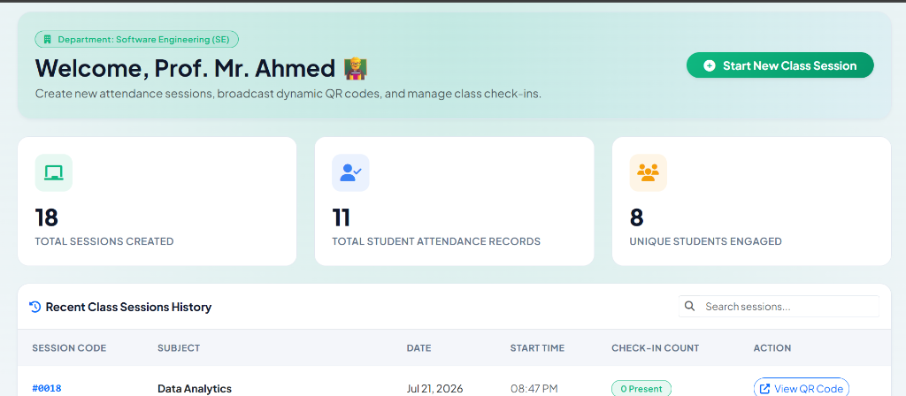
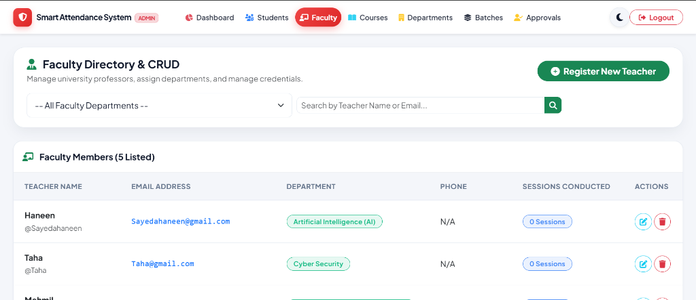
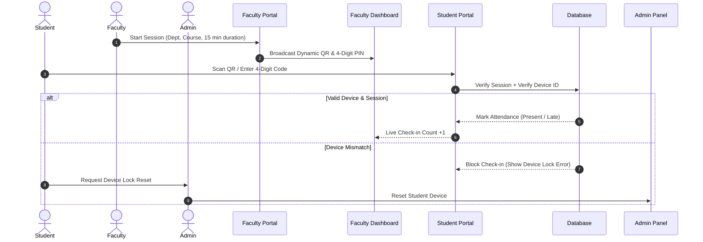

# 🛡️ Smart Attendance System with Offline Dynamic QR & Single-Device Lock

[](https://www.php.net/)
[](https://www.mysql.com/)
[](https://getbootstrap.com/)
[](https://opensource.org/licenses/MIT)

A next-generation, high-security academic attendance tracking application designed to completely eliminate proxy attendance. Leveraging **Offline Dynamic QR Codes** and **Single-Device Hardware Fingerprint Locking**, this system ensures students can only check in from their own authorized mobile device during live, active class sessions.

---

## 🎯 Key Anti-Proxy Security Features

### 1. 🔒 Single-Device Hardware Binding
During registration or first-time portal login, the student's account is automatically locked to their physical smartphone's unique browser footprint (`device_identifier`). 
* **Anti-Fraud Guard**: If a student attempts to log in from a classmate's phone or secondary device to mark them present, the system instantly blocks authentication.
* **Admin Reset**: If a student changes their device, the administrator can securely clear the lock badge in the Faculty Directory.

### 2. ⚡ Offline Dynamic QR Code Refresh
The Faculty Portal generates live, refreshing QR codes synced with a 4-digit session security PIN.
* **Screenshot Prevention**: The QR code automatically updates in real-time. Screenshots shared over WhatsApp/Telegram become invalid within seconds.
* **Camera Access Bypass**: Includes a 4-digit temporary passcode option for students using devices with restricted camera permissions over local HTTP connections.

---

## 🏢 Multi-Role Portals & Modules

### 📸 Application Previews
| Student Login Portal | Faculty Live QR Broadcast | Admin Sidebar Manager |
| :---: | :---: | :---: |
|  |  |  |

### 🎓 1. Student Portal
* **Dashboard Overview**: Displays total present/absent stats, current attendance rate (%), and bound device status.
* **QR Scanning Engine**: Instant web camera scanning to capture live session codes.
* **Manual Verification Entry**: Backup PIN entry modal to verify session attendance.
* **Attendance Ledger**: Paginated, filterable history showing date, time, subject, and status.

### 👨‍🏫 2. Faculty Portal
* **Session Manager**: Create and launch live attendance sessions for specific Departments, Semesters, Batches, and Course Codes.
* **QR Broadcast Display**: Large live dashboard for classroom projection, displaying the active QR code, time remaining, and current live check-in count.
* **Attendance Ledger**: Full database of created class history.
* **Reports Generator**: Detailed analytics, printable tables, and **one-click Excel exporting** (.xlsx) of student check-in rosters.

### 🛡️ 3. System Admin Panel
* **Student Registry**: Review self-registered students, approve queue files, and reset device hardware locks.
* **Faculty Directory**: CRUD operations for university professors, assign departments, and reset credentials.
* **Curriculum Manager**: Manage academic courses, departments, semester intakes, and batch cohorts.

---

## 📐 System Flow Diagram



---

## 🛠️ Technology Stack & Dependencies

* **Frontend**: HTML5, Vanilla CSS3 (custom CSS design system), Javascript (ES6), Bootstrap 5.3 (responsive container layouts), FontAwesome 6.4 (icons).
* **Backend**: PHP (Object-Oriented & Procedural API integration).
* **Database**: MySQL (structured relational design with primary/foreign keys).
* **Server Compatibility**: Local Apache stack (XAMPP / WampServer).

---

## 🚀 Local Installation & Setup Guide

Follow these steps to run the application on your computer using **XAMPP**:

### Prerequisites
1. Download and install [XAMPP for Windows/Mac](https://www.apachefriends.org/).
2. Git installed on your system (optional).

### Step 1: Clone or Copy Project Files
Copy the project folder into your XAMPP root directory (usually `C:\xampp\htdocs\`) on Windows:
```bash
# Move to XAMPP htdocs
cd C:\xampp\htdocs\
```

### Step 2: Set Up Database (MySQL)
1. Start XAMPP Control Panel and click **Start** next to **Apache** and **MySQL**.
2. Open your web browser and navigate to [http://localhost/phpmyadmin/](http://localhost/phpmyadmin/).
3. Click on **New** in the left sidebar and create a database named `attendance_db`.
4. Select the database `attendance_db`, go to the **Import** tab, and select the SQL backup file `database/attendance_db.sql`.
5. Click **Import** (or **Go**) at the bottom.

### Step 3: Configure Database Connection
Open `config.php` located in the project root folder and update database parameters if necessary:
```php
define('DB_HOST', 'localhost');
define('DB_USER', 'root');
define('DB_PASS', ''); // Leave empty for default XAMPP configuration
define('DB_NAME', 'attendance_db');
```

### Step 4: Run the Application
Open your browser and navigate to the project directory:
* **Main Landing Page Gateway**: [http://localhost/Smart-attendance_system/](http://localhost/Smart-attendance_system/)
* **Default Admin Credentials**:
  * **Login URL**: [http://localhost/Smart-attendance_system/admin/login.php](http://localhost/Smart-attendance_system/admin/login.php)
  * **Username**: `admin`
  * **Password**: `admin123`

---

## 👩‍💻 Lead Developer & Project Author

Designed and developed with university-grade verification algorithms and high-security compliance:

<table align="center">
  <tr>
    <td align="center" style="padding: 1.5rem; background: #fafafa; border-radius: 12px; border: 1px solid #eaeaea;">
      <div style="font-weight: 800; font-size: 1.4rem; color: #4f46e5; margin-bottom: 0.5rem;">SH</div>
      <strong>Sayeda Haneen</strong><br>
      <small>Web Developer & Software Architect</small><br>
      <small>Computer Science (Sukkur IBA University)</small><br>
      <a href="mailto:sayedahaneenhussain@gmail.com">sayedahaneenhussain@gmail.com</a><br>
      <a href="https://www.linkedin.com/in/sayedahaneenhussain/" target="_blank"><b>Connect on LinkedIn 🔗</b></a>
    </td>
  </tr>
</table>

---

## 📄 License
This project is licensed under the MIT License - see the [LICENSE](LICENSE) file for details.
